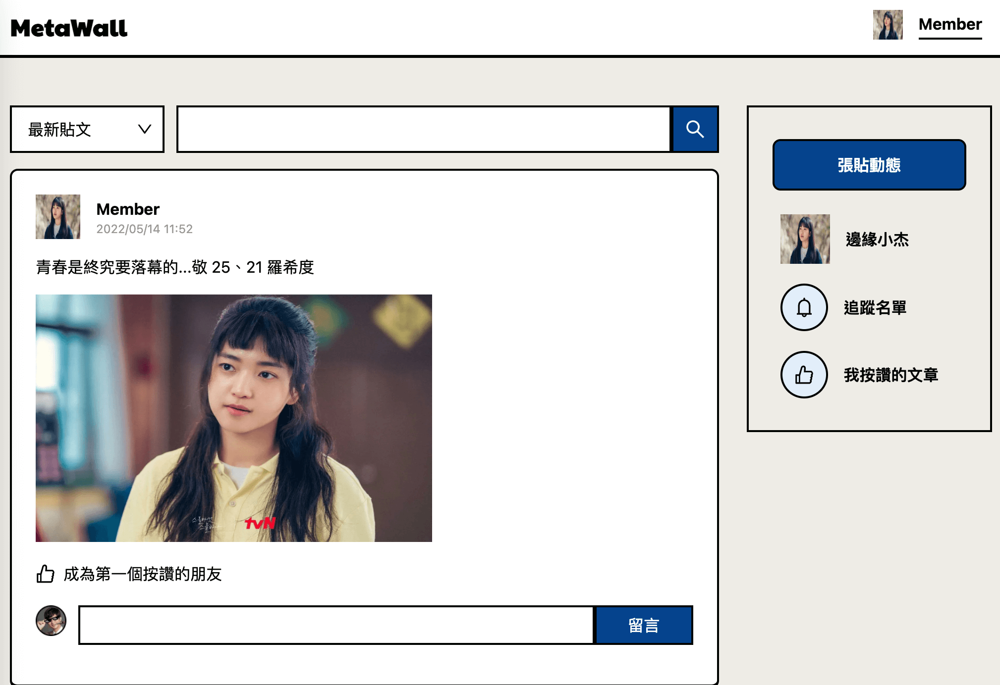

<div align="center">
  <a href="https://github.com/Hazelwu2/week4-nodejs-frontend.git">
    
  </a>

  <h3 align="center">Week4 React + Typescript + Axios</h3>

  <p align="center">
    🌱 貼文動態牆 API in React + Typescript + Axios
    <br />
    <a href="https://github.com/Hazelwu2/week4-nodejs-frontend/issues">Report Bug</a>
    ·
    <a href="http://week4-nodejs-frontend.vercel.app/">線上 Demo</a>
  </p>
</div>

## 🛖 About This Project
第四週六角學院 Nodejs 主線任務，打造全端 (Full Stack) 網站架構，前後端分離開發。
- [後端 API Repo](https://github.com/Hazelwu2/week4-nodejs.git)
- [線上 Demo](http://week4-nodejs-frontend.vercel.app/)


### 等級表
#### LV1：整合 user model，只做後端 API
  - 設計[這頁](https://xd.adobe.com/view/c0763dbe-fc15-42e8-be0b-8956ed03e675-9525/screen/5b6bb2a0-f0f3-4b39-841f-8cf3a0ed9707)的 GET API
  - 設計[這頁](https://xd.adobe.com/view/c0763dbe-fc15-42e8-be0b-8956ed03e675-9525/screen/dfc7891e-63fd-4141-989a-8776ee7ea9f0) POST API
  - 發文人 ID 可先固定

#### LV2：前後端都做
  - 3.[全體動態牆](https://xd.adobe.com/view/c0763dbe-fc15-42e8-be0b-8956ed03e675-9525/screen/5b6bb2a0-f0f3-4b39-841f-8cf3a0ed9707)，並需設計篩選功能(從新到舊貼文、從舊到最新、關鍵字搜尋)
  - 3-3.[全體動態牆-沒有動態](https://xd.adobe.com/view/c0763dbe-fc15-42e8-be0b-8956ed03e675-9525/screen/fb06b070-009d-4ccf-9d60-248b9f51dcd4)
  - 7.[張貼動態](https://xd.adobe.com/view/c0763dbe-fc15-42e8-be0b-8956ed03e675-9525/screen/dfc7891e-63fd-4141-989a-8776ee7ea9f0)：上傳圖片按鈕請移除，改用 input.text，直接放圖片網址，可做簡易 client 驗證，是否開頭字串為 https

#### LV3：前後端都做 + 試著自己接 imgur API
  - 先上傳成功回傳圖片網址後，再送出貼文


## 🔨 Built With
此專案會用到的 Framework / Library 或工具

* [Git](https://git-scm.com/)
* [Nextjs](https://nextjs.org/)
* [React](#)
* [Typescript](#)第四週六角學院 Nodejs 主線任務，打造全端 (Full Stack) 網站架構，前後端分離開發。
* [後端 Nodejs Express API](https://github.com/Hazelwu2/week4-nodejs.git)


## 👨‍💻 Getting Started
以下照著範例做，可以讓你在本地端 run 此專案

1. Clone the Repo
  ```sh
    git clone git@github.com:Hazelwu2/week4-nodejs-frontend.git
  ```
2. Install NPM packages
  ```bash
  cd week4-nodejs-frontend
  npm install
  # Or
  yarn install
  ```
4. Start Runing Server
  ```bash
  npm run dev
  # Or
  yarn dev
  ```

